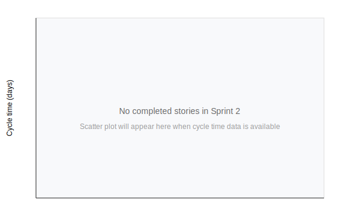

# Sprint Report – Sprint 2

## *Sprint Goal*

By the end of Sprint 2, deliver the core analysis artefacts required to start implementation of the first feature(s): Domain Stories and a User Story Map; a prioritized list of Quality Attribute Scenarios including fitness functions; and Architectural Concerns & Constraints. These artefacts will be validated in a team review with the PO.

Acceptance criteria:
- Domain Stories and a User Story Map for the first feature(s).
- Prioritized list of Quality Attribute Scenarios with explicit fitness functions for each item.
- Architectural Concerns and Constraints documented.
- A 30-minute review/demo with PO and meeting notes recorded.

---

## Team Roles

- **Scrum Master:** Ben Vos
- **Product Owner (Client):** Ivo van Hurne
- **Team Members:** Sepideh, Faezeh, Furqan, Ben (shared responsibilities in development, documentation, and analysis)

---

## Sprint Backlog & Progress

Sprint backlog (this sprint)

- [x] Client meeting
- [x] Coach meeting
- [x] Set of concrete business goals formulated
- [x] Amendments to team charter concerning organisation
- [x] Clear schedule for SCRUM activities
- [x] Impact map
- [x] User story map
- [x] Domain stories
- [x] Prioritized quality attributes with fitness functions
- [x] Architectural concerns and constraints
- [x] Creation of task/issue board

Stories completed: No functional product increment was delivered in this sprint (analysis and setup work completed as listed above). The items above are artefacts and planning deliverables rather than user-story code increments.

---

## Cycle Time
Average cycle time

No completed user stories in Sprint 2 (analysis sprint), so cycle time cannot be calculated for this sprint. For transparency we will track cycle time starting Sprint 3. Example metrics to be reported in future sprints:

- Average cycle time (days) for completed stories
- Median cycle time
- Scatter plot of individual story cycle times (see `Docs/Sprint02/cycle_time_scatter.svg`)

The scatter plot below is a placeholder because there were no completed stories in Sprint 2.

---

## Strategic Updates

- Rough system shape and target functionalities have been agreed (core modules and main user journeys).