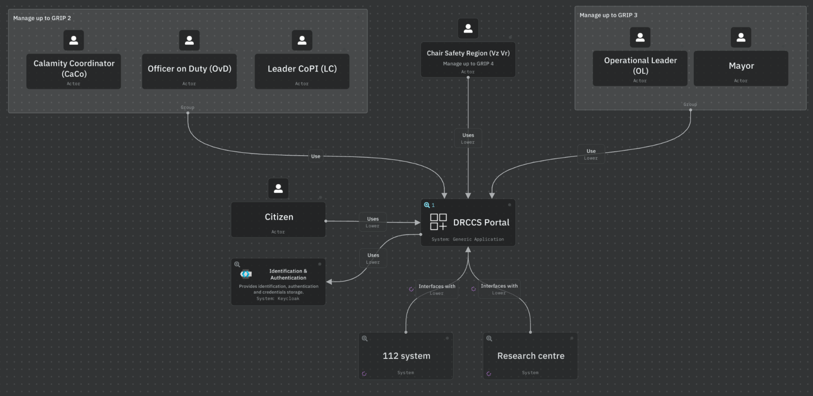
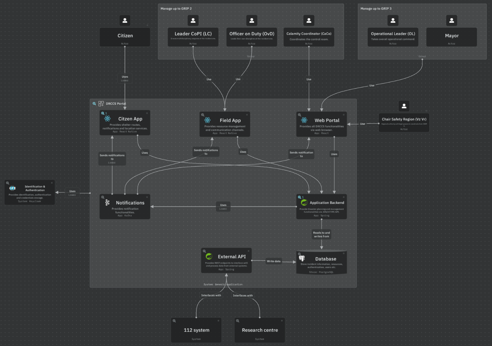

# Architecture

**Technology:** IcePanel

**Interactive model:** [DRCCS C4 Model](https://s.icepanel.io/FnGBZGLNEc8XFe/9m2A)

## Context Architecture

## Container Architecture

- **Separation of Concerns**  
    Each component (App, Web App, Backend, Database, External API) has a clear responsibility, improving maintainability and scalability.

- **Scalability**  
    The backend and database can be scaled independently to handle increased load, while frontend apps (mobile/web) can be updated separately.

- **Flexibility**  
    Multiple actors (Citizens, Responders, Veiligheidsregio) can access the system through different interfaces (mobile app, web app), catering to varied user needs.

- **Interoperability**  
    The External API enables integration with external systems (e.g., 112 system, Research centre), supporting data exchange and collaboration.

- **Security**  
    Centralized authentication and data storage in the backend and database help enforce security policies and protect sensitive information.

- **Extensibility**  
    New functionalities or integrations can be added by extending the backend or external API without major changes to the overall system.

- **Resilience**  
    Decoupled components reduce the risk of system-wide failures; issues in one part (e.g., external API) do not necessarily impact others.

## Component Architecture

