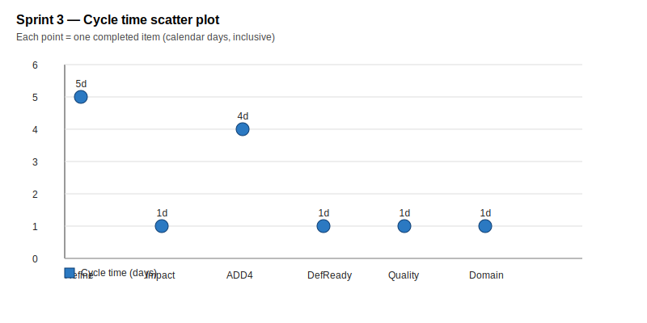

# Sprint Report – Sprint 3

## *Sprint Goal*

Refining user stories and domain to be ready for development. Create a first iteration of the architectural design.

---

## Team Roles

- **Scrum Master:** Ben Vos
- **Product Owner (Client):** Ivo van Hurne
- **Team Members:** Sepideh, Faezeh, Furqan, Ben (shared responsibilities in development, documentation, and analysis)

---

## Sprint Backlog & Progress

Sprint backlog (this sprint)

- [x] Refine user stories (5h) [29/9 - 3/10]
- [x] Iterate impact map (30m) [5/10 - 5/10]
- [x] ADD 4 * (4h) [30/9 - 3/10]
- [x] Definition of Ready (5m) [29/9 - 29/9]
- [x] Iterate Quality Attributes (1h) [2/10 - 2/10]
- [x] Iterate domain stories (1h 30m) [2/10 - 2/10]
- [ ] Wireframes (7h) [2/10 - ...]
- [ ] Backend services (6h) [3/10 - ...]

---

## Cycle Time

Calculation method: calendar days

Completed items in this sprint :

| Item | Start | Done | Cycle time (days) |
| --- | ---: | ---: | ---: |
| Refine user stories | 2025-09-29 | 2025-10-03 | 5 |
| Iterate impact map | 2025-10-05 | 2025-10-05 | 1 |
| ADD 4 * | 2025-09-30 | 2025-10-03 | 4 |
| Definition of Ready | 2025-09-29 | 2025-09-29 | 1 |
| Iterate Quality Attributes | 2025-10-02 | 2025-10-02 | 1 |
| Iterate domain stories | 2025-10-02 | 2025-10-02 | 1 |

Summary metrics

- Number of completed items: 6
- Sum of cycle times: 13 days
- Average cycle time (mean): 13 / 6 = 2.17 days (rounded to 2 d.p.)
- Median cycle time: 1 day

---

## Strategic Updates

- Decided on the architecture and start of frontend design & backend development. 