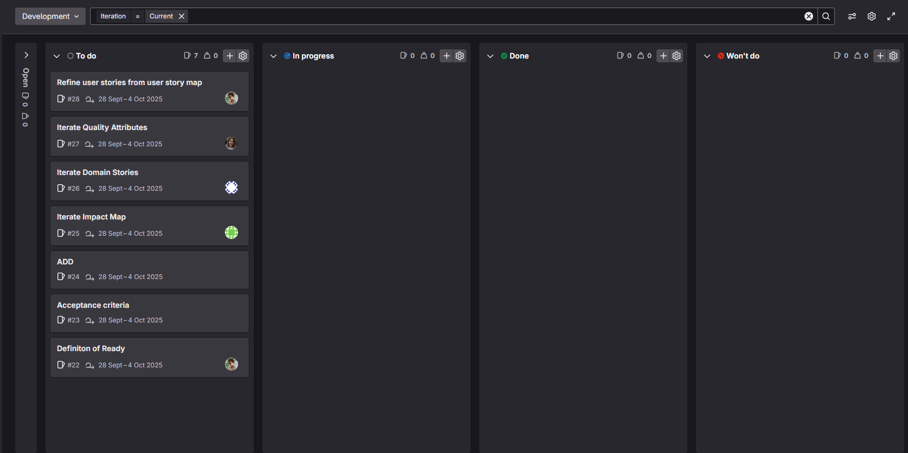

# General
**Attendees:** Scrum Master, Development Team  

**Location:** Saxion

**Date:** 23 September 2025

**Time:** 13:00–13:40

# Planning
**Sprint Goal:**  
Refining user stories and domain to be ready for development. Create a first iteration of the architectural design.

**Sprint Issue board:**  

**Final Commitment:**  
The team confirmed the sprint backlog and goal, committing to deliver the planned work.
