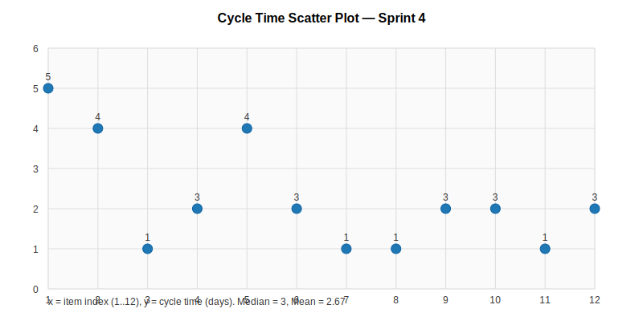
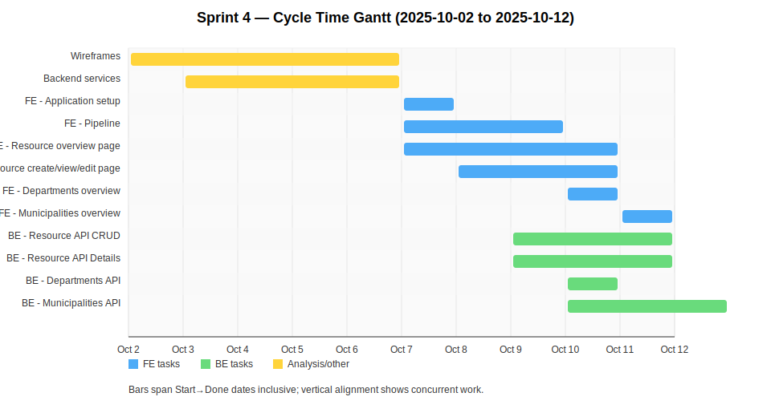

# Sprint Report – Sprint 4

## *Sprint Goal*

Implement the first userstory front to back.

---

## Team Roles

- **Scrum Master:** Ben Vos
- **Product Owner (Client):** Ivo van Hurne
- **Team Members:** Sepideh, Faezeh, Furqan, Ben (shared responsibilities in development, documentation, and analysis)

---

## Sprint Backlog & Progress

Sprint backlog (this sprint)

- [X] Wireframes [2/10 - 6/10]
- [X] Backend services [3/10 - 6/10]
- [X] FE - Application setup [7/10 - 7/10]
- [X] FE - Pipeline [7/10 - 9/10]
- [X] FE - Resource overview page [7/10 - 10/10]
- [X] FE - Resource create/view/edit page [8/10 - 10/10]
- [X] FE - Departments overview [10/10 - 10/10]
- [X] FE - Municipalities overview [11/10 - 11/10]
- [X] BE - Resource API CRUD [9/10 - 11/10]
- [X] BE - Resource API Details [9/10 - 11/10]
- [X] BE - Departments API [10/10 - 10/10]
- [X] BE - Municipalities API [10/10 - 12/10]

---

## Cycle Time

Calculation method: calendar days

Completed items in this sprint :

| Item | Start | Done | Cycle time (days) |
| --- | ---: | ---: | ---: |
| Wireframes | 2025-10-02 | 2025-10-06 | 5 |
| Backend services | 2025-10-03 | 2025-10-06 | 4 |
| FE - Application setup | 2025-10-07 | 2025-10-07 | 1 |
| FE - Pipeline | 2025-10-07 | 2025-10-09 | 3 |
| FE - Resource overview page | 2025-10-07 | 2025-10-10 | 4 |
| FE - Resource create/view/edit page | 2025-10-08 | 2025-10-10 | 3 |
| FE - Departments overview | 2025-10-10 | 2025-10-10 | 1 |
| FE - Municipalities overview | 2025-10-11 | 2025-10-11 | 1 |
| BE - Resource API CRUD | 2025-10-09 | 2025-10-11 | 3 |
| BE - Resource API Details | 2025-10-09 | 2025-10-11 | 3 |
| BE - Departments API | 2025-10-10 | 2025-10-10 | 1 |
| BE - Municipalities API | 2025-10-10 | 2025-10-12 | 3 |

Summary metrics

Number of completed items: 12
Sum of cycle times: 32 days
Average cycle time (mean): 32 / 12 = 2.67 days (rounded to 2 d.p.)
Median cycle time: 3 days

---

## Strategic Updates

- First story implemented in backend and frontend
- Deployment of frontend to AWS
- Fully functional frontend pipeline