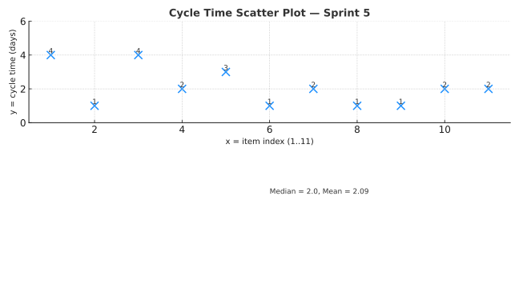
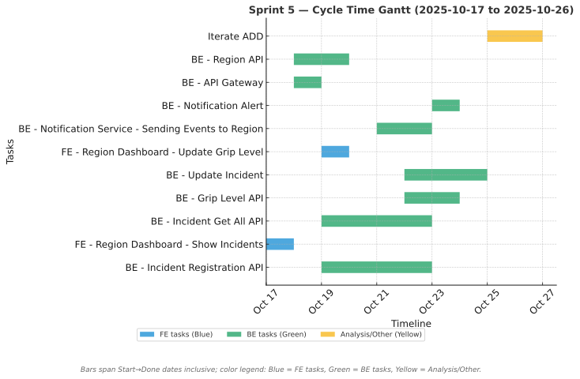

# Sprint Report – Sprint 5

## *Sprint Goal*

Integrate backend and frontend components to enable incident reporting and ensure that new incidents trigger notification messages to the region.

---

## Team Roles

- **Scrum Master:** Ben Vos  
- **Product Owner (Client):** Ivo van Hurne  
- **Team Members:** Sepideh, Faezeh, Furqan, Ben (shared responsibilities in development, documentation, and analysis)

---

## Sprint Backlog & Progress

Sprint backlog (this sprint)

- [X] BE - Incident Registration API [19/10 - 22/10]
- [X] FE - Region Dashboard - Show Incidents [17/10 - 17/10]
- [X] BE - Incident Get All API [19/10 - 22/10]
- [X] BE - Grip Level API [22/10 - 23/10]
- [X] BE - Update Incident [22/10 - 24/10]
- [X] FE - Region Dashboard - Update Grip Level [19/10 - 19/10]
- [X] BE - Notification Service - Sending Events to Region [21/10 - 22/10]
- [X] BE - Notification Alert [23/10 - 23/10]
- [X] BE - API Gateway [18/10 - 18/10]
- [X] BE - Region API [18/10 - 19/10]
- [X] Iterate ADD [25/10 - 26/10]

---

## Cycle Time

Calculation method: calendar days

Completed items in this sprint :

| Item | Start | Done | Cycle time (days) |
| --- | ---: | ---: | ---: |
| BE - Incident Registration API | 2025-10-19 | 2025-10-22 | 4 |
| FE - Region Dashboard - Show Incidents | 2025-10-17 | 2025-10-17 | 1 |
| BE - Incident Get All API | 2025-10-19 | 2025-10-22 | 4 |
| BE - Grip Level API | 2025-10-22 | 2025-10-23 | 2 |
| BE - Update Incident | 2025-10-22 | 2025-10-24 | 3 |
| FE - Region Dashboard - Update Grip Level | 2025-10-19 | 2025-10-19 | 1 |
| BE - Notification Service - Sending Events to Region | 2025-10-21 | 2025-10-22 | 2 |
| BE - Notification Alert | 2025-10-23 | 2025-10-23 | 1 |
| BE - API Gateway | 2025-10-18 | 2025-10-18 | 1 |
| BE - Region API | 2025-10-18 | 2025-10-19 | 2 |
| Iterate ADD | 2025-10-25 | 2025-10-26 | 2 |

Summary metrics

Number of completed items: **11**  
Sum of cycle times: **23 days**  
Average cycle time (mean): **2.09 days**  
Median cycle time: **2 days**

---

## Strategic Updates

- Full integration achieved between backend and frontend for incident reporting.  
- Incident creation now automatically triggers region-level notifications via the Notification Service.  
- Implemented and tested APIs for Incident, Grip Level, and Region coordination.  
- Established API Gateway for service routing and consistent backend access.  
- Frontend now displays real-time incident updates on the Region Dashboard.  
- Added ADD (Attribute-Driven Design) iteration to refine architectural documentation.  
- Overall sprint completed successfully with improved development coordination and stable communication flow between services.
