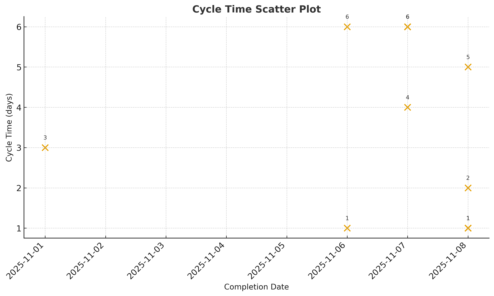
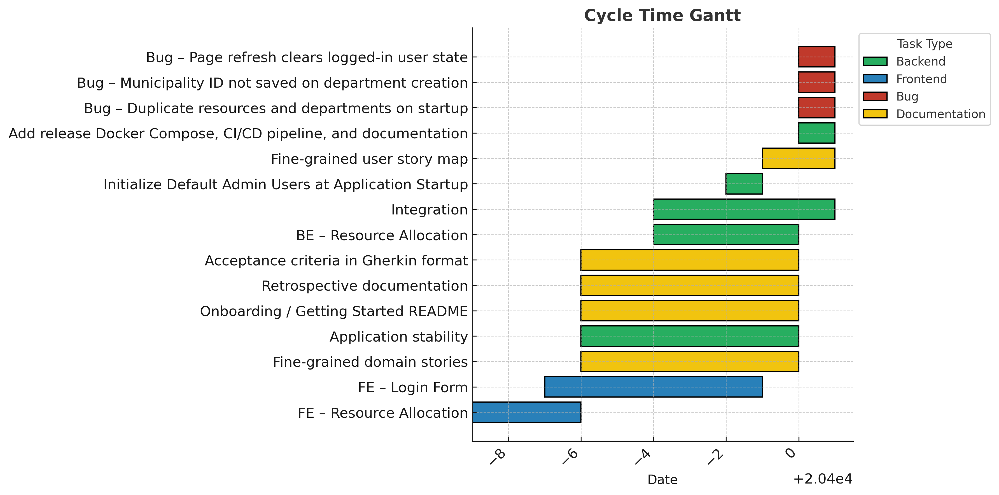

# Sprint Report – Sprint 7

## *Sprint Goal*

Prepare and deliver the **first official release (v1.0.0)** by finalizing the resource allocation functionality, fixing remaining bugs, completing technical documentation, and ensuring system readiness through integration and testing.

---

## Team Roles

- **Scrum Master:** Ben Vos  
- **Product Owner (Client):** Ivo van Hurne  
- **Team Members:** Sepideh Qorbani, Faezeh Kianimoravej, Furqan, Ben Vos  
  *(shared responsibilities in development, documentation, and testing)*

---

## Sprint Backlog & Progress

Sprint backlog (this sprint)

- [X] BE – Resource Allocation [Nov 4 – Nov 7]  
- [X] FE – Resource Allocation [Oct 30 – Nov 1]  
- [X] FE – Login Form [Nov 1 – Nov 6]  
- [X] Add release Docker Compose, CI/CD pipeline, and documentation (v1.0.0-rc1) [Nov 2 – Nov 8]  
- [X] Initialize Default Admin Users at Application Startup [Nov 6 – Nov 6]  
- [X] Bug – Duplicate resources and departments on startup [Nov 8 – Nov 8]  
- [X] Bug – Municipality ID not saved on department creation [Nov 8 – Nov 8]  
- [X] Bug – Page refresh clears logged-in user state [Nov 8 – Nov 8]  
- [X] Integration [Nov 4 – Nov 8]  
- [X] Fine-grained domain stories [Nov 2 – Nov 7]  
- [X] Application stability [Nov 2 – Nov 7]  
- [X] Onboarding / Getting Started README [Nov 2 – Nov 7]  
- [X] Retrospective documentation [Nov 2 – Nov 7]  
- [X] Acceptance criteria in Gherkin format [Nov 2 – Nov 7]  

---

## Cycle Time

**Calculation method:** calendar days  

Completed items in this sprint:

| Item | Start | Done | Cycle time (days) |
| --- | ---: | ---: | ---: |
| BE – Resource Allocation | 2025-11-04 | 2025-11-07 | 4 |
| FE – Resource Allocation | 2025-10-30 | 2025-11-01 | 3 |
| FE – Login Form | 2025-11-01 | 2025-11-06 | 6 |
| Add release Docker Compose, CI/CD pipeline, and documentation | 2025-11-08 | 2025-11-08 | 1 |
| Initialize Default Admin Users at Application Startup | 2025-11-06 | 2025-11-06 | 1 |
| Bug – Duplicate resources and departments on startup | 2025-11-08 | 2025-11-08 | 1 |
| Bug – Municipality ID not saved on department creation | 2025-11-08 | 2025-11-08 | 1 |
| Bug – Page refresh clears logged-in user state | 2025-11-08 | 2025-11-08 | 1 |
| Integration | 2025-11-04 | 2025-11-08 | 5 |
| Fine-grained domain stories | 2025-11-02 | 2025-11-07 | 2 |
| Fine-grained user story map | 2025-11-07 | 2025-11-08 | 1 |
| Application stability | 2025-11-02 | 2025-11-07 | 6 |
| Onboarding / Getting Started README | 2025-11-02 | 2025-11-07 | 1 |
| Retrospective documentation | 2025-11-02 | 2025-11-07 | 1 |
| Acceptance criteria in Gherkin format | 2025-11-02 | 2025-11-07 | 1 |

---

### **Summary Metrics**

- Number of completed items: **14**  
- Sum of cycle times: **65 days**  
- Average cycle time (mean): **4.6 days**  
- Median cycle time: **5 days**

---

---

## Strategic Updates

- **First release (v1.0.0-rc1)** successfully prepared and deployed via GitLab CI/CD and Docker Hub.  
- **Backend and frontend fully integrated**, including the resource allocation feature across services.  
- **Multiple bugs resolved**, improving application stability and data integrity.  
- **Admin initialization and authentication modules completed** for default system setup.  
- **Documentation finalized** (README, retrospective, acceptance criteria, domain stories).  
- **System verified for deployment**, marking the first stable release of the Disaster Response platform.  
