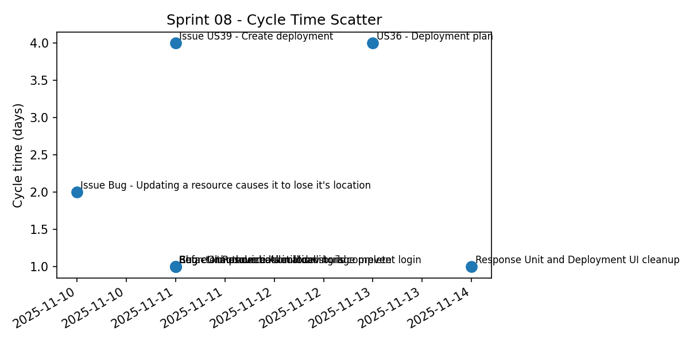
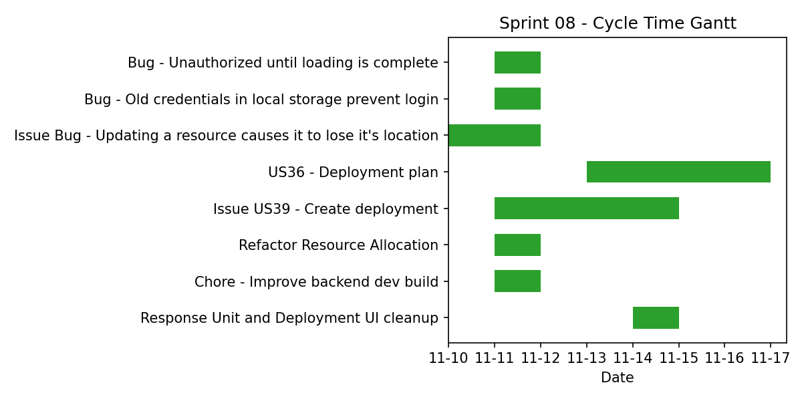

# Sprint Report – Sprint 8

## *Sprint Goal*

Assign users to incidents based on deployment orders and set up Keycloack security for the application backend.

---

## Team Roles

- **Scrum Master:** Ben Vos  
- **Product Owner (Client):** Ivo van Hurne  
- **Team Members:** Sepideh Qorbani, Faezeh Kianimoravej, Furqan, Ben Vos  
  *(shared responsibilities in development, documentation, and testing)*

---

## Sprint Backlog & Progress

Sprint backlog (this sprint)

- [X] Bug - Unauthorized until loading is complete [Nov 11 – Nov 11]
- [X] Bug - Old credentials in local storage prevent login [Nov 11 – Nov 11]
- [X] Issue Bug - Updating a resource causes it to lose it's location [Nov 10 – Nov 11]
- [X] US36 - Deployment plan [Nov 13 – Nov 16]
- [ ] US38 - Keycloak implemenation and integration [Nov 11 – end]
- [X] Issue US39 - Create deployment [Nov 11 – Nov 14]
- [X] Refactor Resource Allocation [Nov 11 – Nov 11]
- [X] Chore - Improve backend dev build [Nov 11 – Nov 11]
- [X] Response Unit and Deployment UI cleanup [Nov 14 – Nov 14]

Replace the checklist above with story points in parentheses after each item, e.g. `- [X] US36 - Deployment plan (5 SP) [Nov 13 – Nov 16]`.

---

## Cycle Time

**Calculation method:** calendar days  

Completed items in this sprint:

| Item | Start | Done | Cycle time (days) | SP |
| --- | ---: | ---: | ---: | ---: |
| Bug - Unauthorized until loading is complete | 2025-11-11 | 2025-11-11 | 1 | 1 |
| Bug - Old credentials in local storage prevent login | 2025-11-11 | 2025-11-11 | 1 | 2 |
| Issue Bug - Updating a resource causes it to lose it's location | 2025-11-10 | 2025-11-11 | 2 | 1 |
| US36 - Deployment plan | 2025-11-13 | 2025-11-16 | 4 | 13 |
| US39 - Create deployment | 2025-11-11 | 2025-11-14 | 4 | 5 |
| Refactor Resource Allocation | 2025-11-11 | 2025-11-11 | 1 | 1 |
| Chore - Improve backend dev build | 2025-11-11 | 2025-11-11 | 1 | 1 |
| Response Unit and Deployment UI cleanup | 2025-11-14 | 2025-11-14 | 1 | 2 |

---

### **Summary Metrics**

- Number of completed items: **8**  
- Sum of cycle times: **15 days**  
- Average cycle time (mean): **1.9 days**  
- Median cycle time: **1 day**

- Story points completed: **26**  
- Planned story points: **24**  
- Completion ratio: **108%**

---

---

## Strategic Updates

- **Release status:** v1.1.1
- **Integration:** Deployment order, deployment request and response unit fully integrated. Keycloack integration in progress.
- **Bugs resolved:** Resolved various bugs related to performance, auth and resources.
