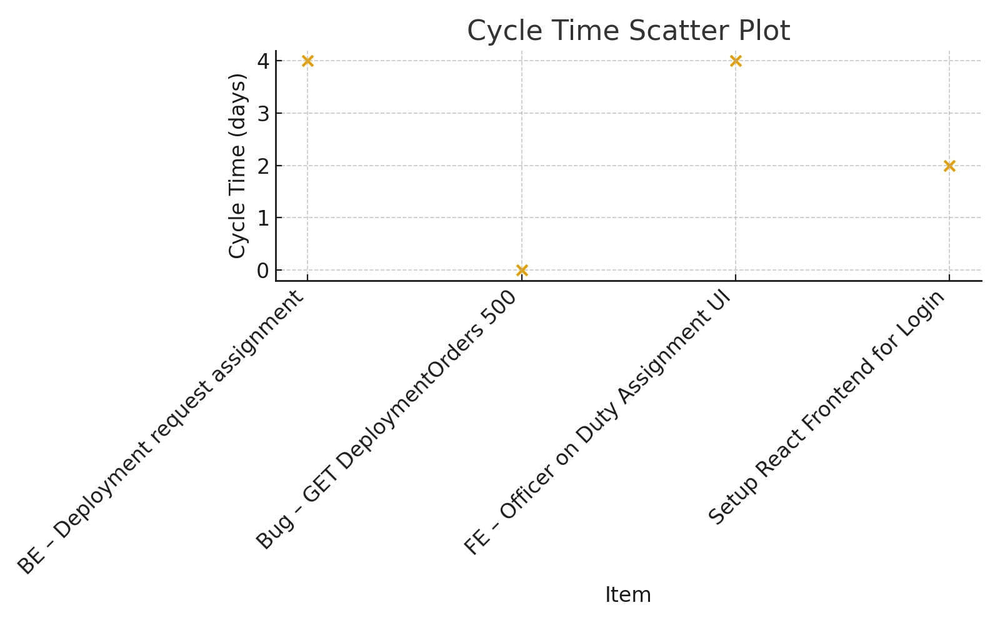
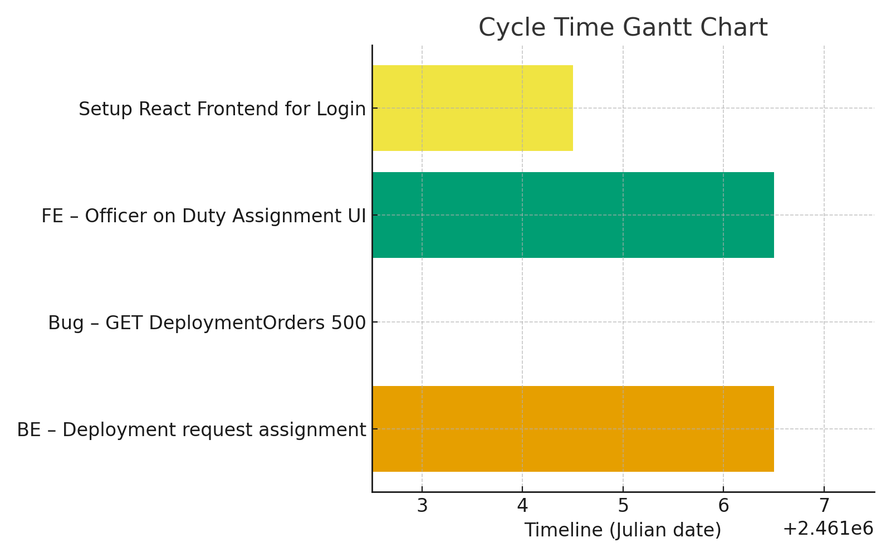

# Sprint Report – Sprint 10

## *Sprint Goal*

Finalize deployment request assignment for departments and continue Keycloak integration to secure backend–frontend communication.

---

## Team Roles

- **Scrum Master:** Ben Vos  
- **Product Owner (Client):** Ivo van Hurne  
- **Team Members:** Sepideh Qorbani, Faezeh Kianimoravej, Furqan Malik, Ben Vos  
  *(shared responsibilities in development, documentation, and testing)*

---

## Sprint Backlog & Progress

Sprint backlog (this sprint)

- [X] BE – Deployment request assignment (8 SP) [Nov 23 – Nov 27]  
- [X] Bug – GET DeploymentOrders 500 response (2 SP) [Nov 28 – Nov 28]  
- [X] FE – Officer on Duty Deployment Assignment UI (5 SP) [Nov 23 – Nov 27]  
- [X] Setup React Frontend for Login (3 SP) [Nov 23 – Nov 25]  
- [ ] US38 – Keycloak implementation and integration (8 SP) [Nov 23 – end]  

---

## Cycle Time

**Calculation method:** calendar days

Completed items in this sprint:

| Item | Start | Done | Cycle time (days) | SP |
| --- | ---: | ---: | ---: | ---: |
| BE – Deployment request assignment | 2025-11-23 | 2025-11-27 | 5 | 8 |
| Bug – GET DeploymentOrders returns 500 | 2025-11-28 | 2025-11-28 | 1 | 2 |
| FE – Officer on Duty Assignment UI | 2025-11-23 | 2025-11-27 | 5 | 5 |
| Setup React Frontend for Login | 2025-11-23 | 2025-11-25 | 3 | 3 |

---

### Summary Metrics

- Number of completed items: **4**  
- Sum of cycle times: **14 days**  
- Average cycle time (mean): **3.5 days**  
- Median cycle time: **4 days**

- Story points completed: **18**  
- Story points planned: **26**  
- Completion ratio: **69%**

---

## Cycle Time Charts

---

## Strategic Updates

- **Release status:** internal build progressing toward next release.  
- **Integration:** Backend + Frontend for deployment request assignment fully operational end-to-end.  
- **Keycloak:** partially integrated; gateway authentication running, microservice validation continues next sprint.  
- **Bugs resolved:** Critical 500 error fixed for deployment order retrieval.

