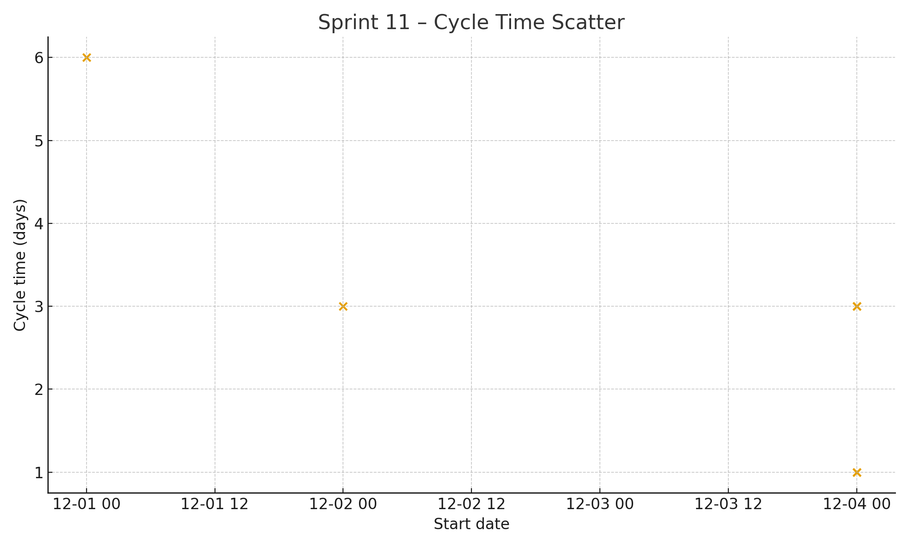
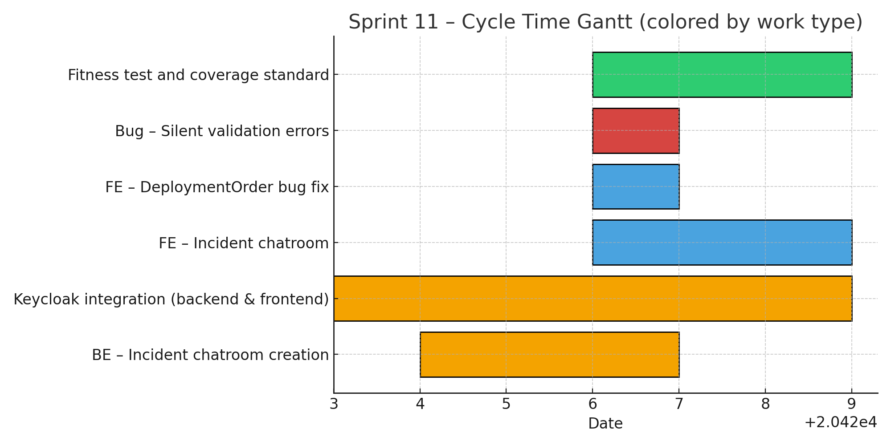

# Sprint Report – Sprint 11

## *Sprint Goal*

Enable secure real-time communication through chat functionality, complete Keycloak-based authentication, and validate system performance via incident registration load testing.

---

## Team Roles

- **Scrum Master:** Ben Vos
- **Product Owner (Client):** Ivo van Hurne
- **Team Members:** Sepideh, Faezeh, Furqan, Ben  
  *(shared responsibilities in development, testing, and documentation)*

---

## Sprint Dates

- **Sprint duration:** December 1 – December 7, 2025

---

## Sprint Backlog & Progress

Sprint backlog (this sprint)

- [X] BE – Incident Chatroom Creation
- [X] FE – Incident Chatroom
- [X] Integration of Keycloak with Backend and Frontend
- [X] Performance Test – Incident Registration
- [X] Fitness Test and Coverage Standard
- [X] Bug – Silent form validation errors not displayed
- [X] FE – Check bug in DeploymentOrder

---

## Cycle Time

Calculation method: calendar days

Completed items in this sprint:

| Item | Start | Done | Cycle time (days) |
| --- | ---: | ---: | ---: |
| BE – Incident chatroom creation | 2025-12-02 | 2025-12-04 | 3 |
| FE – Incident chatroom | 2025-12-04 | 2025-12-06 | 3 |
| Fitness test and coverage standard | 2025-12-04 | 2025-12-06 | 3 |
| FE – DeploymentOrder bug fix | 2025-12-04 | 2025-12-04 | 1 |
| Bug – Silent validation errors | 2025-12-04 | 2025-12-04 | 1 |
| Keycloak integration (backend & frontend) | 2025-12-01 | 2025-12-06 | 6 |

### Summary metrics

Number of completed items: **6**  
Sum of cycle times: **17 days**  
Average cycle time (mean): **2.83 days**  
Median cycle time: **3 days**

---

## Strategic Updates

- Successfully implemented **end-to-end chat functionality**, covering both backend chatroom creation and frontend chat interface for incidents.
- Completed full **Keycloak integration**, securing communication between frontend and backend services and enforcing authentication mechanisms across the system.
- Designed and executed **performance tests for incident registration**, validating system behaviour and responsiveness under load.
- Defined and applied a **fitness test and coverage standard**, strengthening quality assurance and non-functional validation practices.
- Addressed UI and validation-related bugs, improving overall **usability and robustness** of the frontend.
- This sprint significantly improved system maturity by combining **functional delivery (chat)**, **security (authentication)**, and **performance validation** within a single iteration.
