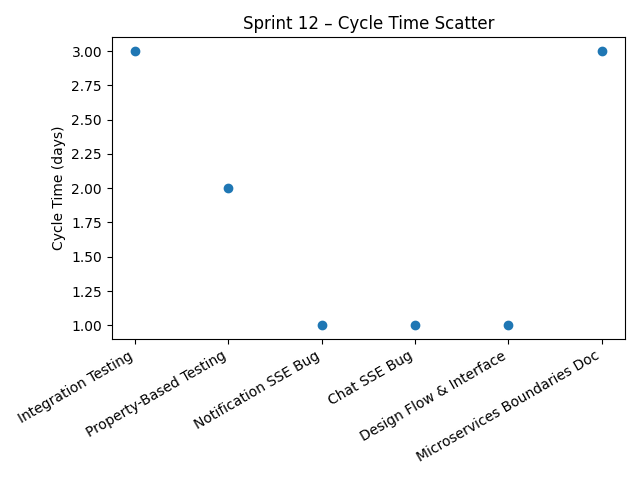
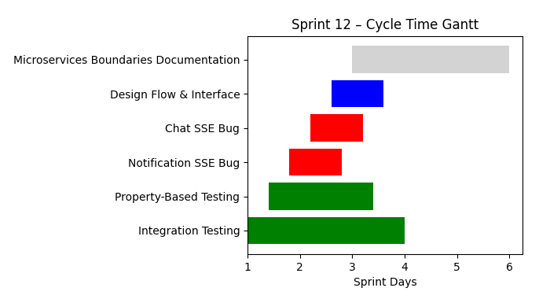

# Sprint Report – Sprint 12

## *Sprint Goal*

Improve system reliability and architectural clarity by implementing and stabilizing
integration testing practices, resolving critical SSE-related bugs, documenting
microservice boundaries and service interactions, **and designing the Responder
Dashboard for the mobile application**.

---

## Team Roles

- **Scrum Master:** Ben Vos
- **Product Owner (Client):** Ivo van Hurne
- **Team Members:** Sepideh, Faezeh, Furqan, Ben  
  *(shared responsibilities in development, testing, bug fixing, and documentation)*

---

## Sprint Dates

- **Sprint duration:** December 7 – December 13, 2025

---

## Sprint Backlog & Progress

Sprint backlog (this sprint)

- [X] Integration Testing Implementation
- [X] Phase 1 – Select Property-Based Testing Framework
- [X] Bug – Notification SSE endpoints return 401 Unauthorized
- [X] Bug – Chat SSE unauthorized, message duplication
- [X] Design – Flow and interface
- [X] ADD – Microservices Boundaries and Organization Service Documentation

---

## Cycle Time

Calculation method: calendar days

Completed items in this sprint:

| Item | Start | Done | Cycle time (days) |
| --- | ---: | ---: | ---: |
| Integration Testing Implementation | 2025-12-11 | 2025-12-13 | 3 |
| Phase 1 – Property-Based Testing framework selection | 2025-12-12 | 2025-12-13 | 2 |
| Bug – Notification SSE unauthorized (401) | 2025-12-12 | 2025-12-12 | 1 |
| Bug – Chat SSE unauthorized & duplication | 2025-12-11 | 2025-12-11 | 1 |
| Design – Flow and interface | 2025-12-12 | 2025-12-12 | 1 |
| ADD – Microservices boundaries documentation | 2025-12-11 | 2025-12-13 | 3 |

### Summary metrics

Number of completed items: **6**  
Sum of cycle times: **11 days**  
Average cycle time (mean): **1.83 days**  
Median cycle time: **1.5 days**

---

## Strategic Updates

- Implemented and documented an **integration testing approach** covering cross-service
  communication, API contract validation, and event-driven workflows.
- Selected a **property-based testing framework** as a foundation for validating service
  interactions and contracts under varying input conditions.
- Resolved critical **SSE-related authorization issues**, including 401 responses on
  notification endpoints and message duplication in chat streams.
- Improved system robustness by addressing **real-time communication edge cases**
  uncovered during integration testing.
- Documented **microservice boundaries and the Organization Service**, improving
  architectural clarity and shared understanding within the team.
- Designed the **Responder Dashboard for the mobile application**, aligning responder
  workflows with real-time incident and notification flows.
- Finalized **design flow and interface decisions**, aligning frontend–backend interaction
  patterns with the documented architecture.

---

## Sprint Conclusion

Sprint 12 focused on **system stability, quality assurance, and architectural clarity**.
By combining integration testing, critical bug fixes, design alignment, mobile dashboard
design, and formal documentation, the team significantly improved the reliability and
maintainability of the platform while laying a strong foundation for future development
and CI/CD integration.
