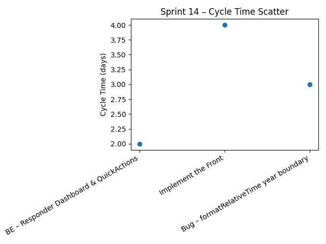
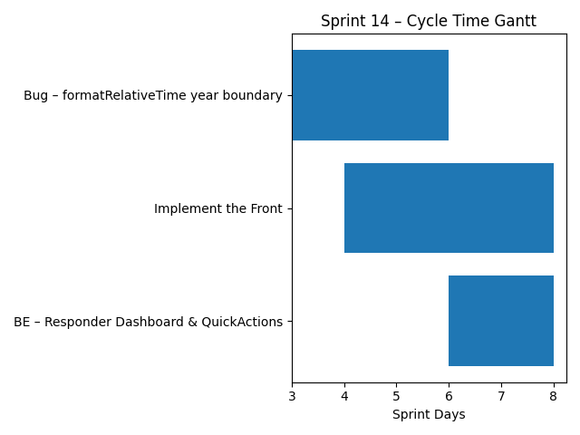

# Sprint Report – Sprint 14

## *Sprint Goal*

Complete the implementation of the **Responder Crisis Update flow** by finalizing both backend and frontend parts, stabilizing supporting UI utilities, and fixing critical date formatting issues affecting test reliability. The sprint focuses on delivering a fully functional Responder Dashboard interaction pipeline from UI to backend.

---

## Team Roles

- **Scrum Master:** Ben Vos  
- **Product Owner (Client):** Ivo van Hurne  
- **Team Members:** Sepideh, Faezeh, Furqan, Ben  
  *(shared responsibilities in development, implementation, bug fixing, and review)*

---

## Sprint Dates

- **Sprint duration:** January 4 – January 10, 2026

---

## Sprint Backlog & Progress

Sprint backlog (this sprint)

- [x] **BE – Implement endpoints for Responder Dashboard and Send QuickActions** (#166)  
- [x] **Implement the Front** (#163)  
- [x] **Bug – formatRelativeTime test fails across year boundaries** (#164)

All planned items for this sprint were completed and closed successfully.

---

## Cycle Time

Calculation method: calendar days

Completed items in this sprint:

| Item | Start | Done | Cycle time (days) |
|------|-------|-------|-------------------|
| BE – Implement endpoints for Responder Dashboard and Send QuickActions | 2026-01-09 | 2026-01-10 | 2 |
| Implement the Front | 2026-01-07 | 2026-01-10 | 4 |
| Bug – formatRelativeTime year boundary issue | 2026-01-06 | 2026-01-08 | 3 |

### Summary metrics

Number of completed items: **3**  
Sum of cycle times: **9 days**  
Average cycle time (mean): **3 days**  
Median cycle time: **3 days**

---

## Strategic Updates

- Implemented the **backend endpoints for the Responder Dashboard**, enabling responders to retrieve active incident data and submit QuickActions as part of the crisis update flow.
- Completed the **frontend implementation** of the Responder Crisis Update feature, integrating UI flows with the newly delivered backend APIs.
- Established a fully working **end-to-end interaction chain** between frontend and backend for responder updates.
- Fixed a critical **date formatting bug** in `formatRelativeTime` that caused test failures when crossing year boundaries, improving test reliability and long-term maintainability.
- Improved **test robustness** by removing hidden time-dependent assumptions in frontend utility logic.
- Finalized the **US10 – Responder Crisis Update Submission** feature from both architectural and functional perspectives.

---

## Sprint Conclusion

Sprint 14 was focused on **feature completion and stabilization**. By finalizing both the backend and frontend parts of the Responder Crisis Update flow and resolving a critical time-dependent bug, the team successfully delivered a fully functional and reliable responder interaction pipeline. This sprint marks the **functional completion of US10** and significantly increases the system’s readiness for real-world usage and integration testing.
