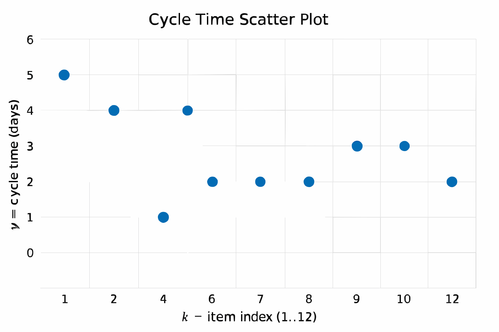
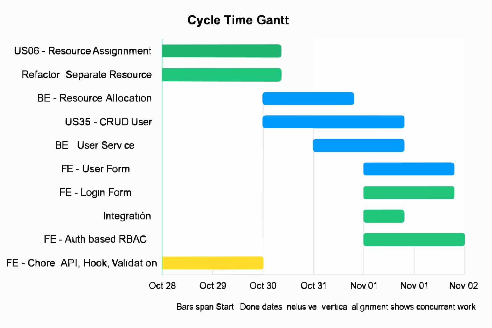

# Sprint Report – Sprint 6

## *Sprint Goal*

Refactor and expand system functionality to include resource assignment, user management, and authentication features.

---

## Team Roles

- **Scrum Master:** Ben Vos  
- **Product Owner (Client):** Ivo van Hurne  
- **Team Members:** Sepideh, Faezeh, Furqan, Ben (shared responsibilities in development, documentation, and integration)

---

## Sprint Backlog & Progress

Sprint backlog (this sprint)

- [X] US06 - Resource Assignment [30/10 - 02/11]  
- [X] Refactor: Separate Resource and Department into individual services/API’s [30/10 - 02/11]  
- [X] BE - Resource Allocation [28/10 - 01/11]  
- [X] US35 - CRUD User [28/10 - 01/11]  
- [X] BE - User Service [28/10 - 01/11]  
- [X] FE - User Form [28/10 - 01/11]  
- [X] FE - Login Form [01/11 - 01/11]  
- [X] Integration [01/11 - 01/11]  
- [X] FE - Auth based RBAC [30/10 - 01/11]  
- [X] FE - Chore: API, Hook, Validation and Form uniformity [30/10 - 01/11]  

---

## Cycle Time

**Calculation method:** calendar days  

Completed items in this sprint:

| Item | Start | Done | Cycle time (days) |
| --- | ---: | ---: | ---: |
| US06 - Resource Assignment | 2025-10-30 | 2025-11-02 | 4 |
| Refactor: Separate Resource and Department... | 2025-10-30 | 2025-11-02 | 4 |
| BE - Resource Allocation | 2025-10-28 | 2025-11-01 | 5 |
| US35 - CRUD User | 2025-10-28 | 2025-11-01 | 5 |
| BE - User Service | 2025-10-28 | 2025-11-01 | 5 |
| FE - User Form | 2025-10-28 | 2025-11-01 | 5 |
| FE - Login Form | 2025-11-01 | 2025-11-01 | 1 |
| Integration | 2025-11-01 | 2025-11-01 | 1 |
| FE - Auth based RBAC | 2025-10-30 | 2025-11-01 | 3 |
| FE - Chore: API, Hook, Validation and Form uniformity | 2025-10-30 | 2025-11-01 | 3 |

---

### **Summary Metrics**

- Number of completed items: **10**  
- Sum of cycle times: **36 days**  
- Average cycle time (mean): **3.6 days**  
- Median cycle time: **4 days**

---

  

  

---

## Strategic Updates

- **Major refactor completed:** Resource and Department modules separated into independent services for cleaner architecture and scalability.  
- **New user management features added** (CRUD and authentication).  
- **RBAC (Role-Based Access Control)** integrated on the frontend.  
- **Form and validation handling** standardized for consistency.  
- **Integration phase completed successfully**, verifying communication between backend and frontend modules.  
