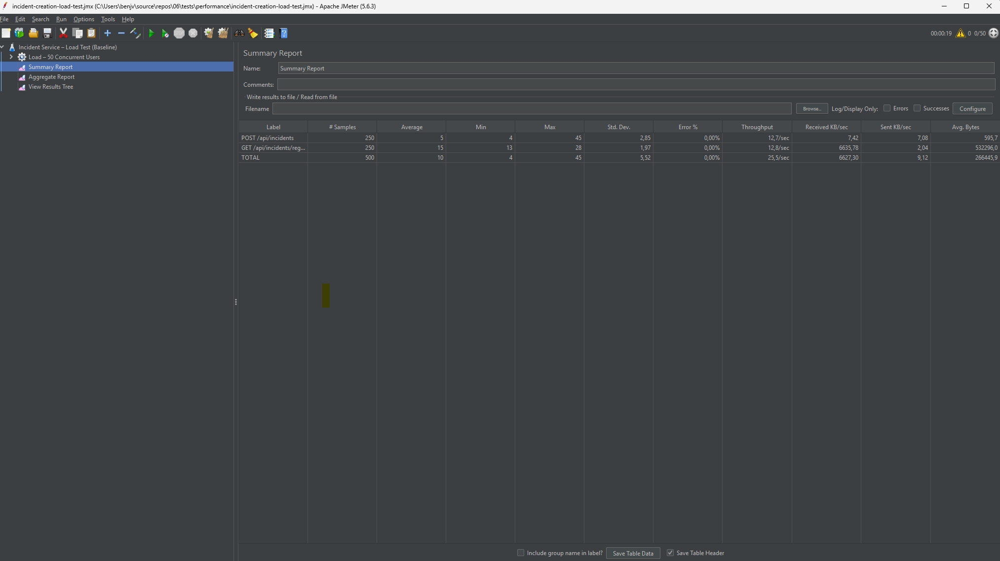
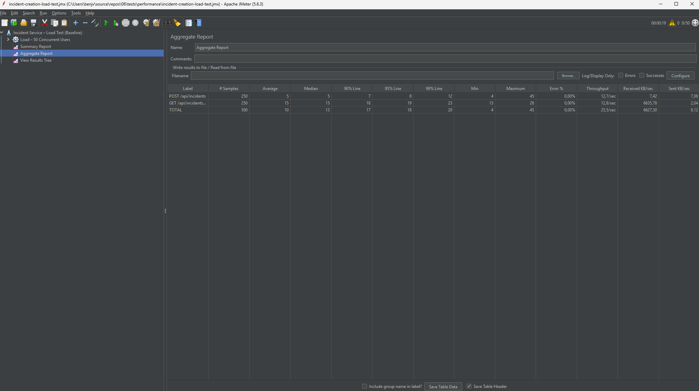

# Performance Test Report – Load Tests

## 1. Purpose

The purpose of these load tests is to evaluate whether critical services in the
**Disaster Response System** meet their **performance and availability quality attributes**
under concurrent usage.

This report covers two essential workflows:

1. **Incident Creation** (`POST /api/incidents`) – The entry point for reporting
   new disaster incidents. If this becomes slow or unavailable, the entire response
   workflow is blocked.

2. **Incident Status Retrieval** (`GET /api/incidents/region/{regionId}`) – Responders
   checking current incident status in their region. This represents a critical read
   operation during active response coordination.

---

## 2. Test Environment

- **Tool:** Apache JMeter 5.6.3
- **Environment:** Local development environment
- **Services under test:** Incident Service
- **Endpoints:**
  - `POST /api/incidents`
  - `GET /api/incidents/region/{regionId}`
- **Protocol:** HTTP

> Note: These tests were executed in a local environment using single service
instances and therefore represent **baseline performance scenarios**.

---

## 3. Test Scenarios

### Test 1: Incident Creation

| Parameter | Value |
|----------|-------|
| Concurrent users | 50 |
| Ramp-up time | 20 seconds |
| Requests per user | 5 |
| Total requests | 250 |
| Request method | HTTP POST |
| Endpoint | `/api/incidents` |
| Assertion | HTTP 201 Created |

### Test 2: Incident Status Retrieval

| Parameter | Value |
|----------|-------|
| Concurrent users | 50 |
| Ramp-up time | 20 seconds |
| Requests per user | 5 |
| Total requests | 250 |
| Request method | HTTP GET |
| Endpoint | `/api/incidents/region/1` |
| Assertion | HTTP 200 OK |

Each virtual user simulates their respective action under concurrent load.
Response assertions ensure only successful operations (`HTTP 201 Created` for writes,
`HTTP 200 OK` for reads) are considered valid.

---

## 4. Quality Attributes and Fitness Function

### Quality Attributes

- **Performance:** Services should process requests within acceptable response
  times under concurrent load.
- **Availability:** Services should remain available and respond without errors
  during the test.

### Fitness Function

The system is considered to satisfy its quality attributes if:

- **95th percentile (P95) response time ≤ 500 ms**
- **Error rate = 0%**

---

## 5. Test Results

### Test 1: Incident Creation (`POST /api/incidents`)

#### Test 1: Summary Metrics

| Metric | Result |
|------|--------|
| Total requests | 250 |
| Average response time | 5 ms |
| Median response time | 5 ms |
| 90th percentile | 7 ms |
| **95th percentile (P95)** | **8 ms** |
| Error rate | **0.00%** |
| Throughput | ~12.7 requests/sec |

#### Test 1: Result Status

✅ **PASS**

The Incident Service successfully processed all requests within the defined
performance thresholds and without errors.

---

### Test 2: Incident Status Retrieval (`GET /api/incidents/region/1`)

#### Test 2: Summary Metrics

| Metric | Result |
|------|--------|
| Total requests | 250 |
| Average response time | 15 ms |
| Median response time | 15 ms |
| 90th percentile | 18 ms |
| **95th percentile (P95)** | **19 ms** |
| Error rate | **0.00%** |
| Throughput | ~12.8 requests/sec |

#### Test 2: Result Status

✅ **PASS**

The Incident Service successfully processed all status retrieval requests with
excellent performance, demonstrating the efficiency of read operations.

---

### JMeter Results Evidence

The following figures provide objective evidence of the test execution
and validate the reported metrics.

#### Incident Creation Test

  
*Figure 1: JMeter Summary Report showing combined results for incident creation and retrieval with zero errors and stable response times under concurrent load.*

  
*Figure 2: JMeter Aggregate Report highlighting percentile-based response time distribution across all operations.

---

## 6. Interpretation

The results demonstrate that the Incident Service can handle **50 concurrent
requests** for both write and read operations while maintaining low latency and
zero error rates.

**Incident Creation:** The service demonstrated exceptional performance with a P95 latency
of just **8 ms**, far exceeding the 500ms threshold. This confirms that incident reporting
can handle concurrent load with minimal latency overhead.

**Incident Status Retrieval:** Read operations demonstrated outstanding performance with
a P95 latency of just **19 ms**. This confirms that responders can instantly check
incident status even under concurrent load, enabling rapid decision-making during
active response coordination.

Although some requests showed higher response times (visible in higher percentiles),
the **P95 latency** for both operations remained well below the defined threshold.
Such outliers are expected in local environments due to JVM warm-up effects and
temporary resource contention.

---

## 7. Scope and Limitations

- These tests represent **baseline load tests**, not stress tests.
- Tests were executed in a **local development environment**, not in a
  production-like distributed setup.
- Higher concurrency levels (e.g. 100+ users) were intentionally not tested in
  this iteration to avoid environment-induced distortions.
- The incident status test assumes at least one incident exists for region ID=1.

Future work may include stress testing or endurance testing in a
production-like environment.

---

## 8. Conclusion

These load tests confirm that the **Incident Service meets its performance and
availability requirements under normal concurrent usage** for both write and read
operations.

The service satisfies the defined fitness function for both test scenarios:

- **Incident Creation:** Processes incident creation with a P95 latency of 8 ms
- **Incident Status Retrieval:** Retrieves incident status with a P95 latency of 19 ms

The system demonstrates readiness for production deployment under expected load conditions.

---

## Related Files

- `incident-creation-load-test.jmx` (contains both test scenarios)
- `README.md` (execution instructions)
- `images/summary-report.png`
- `images/aggregate-report.png`
